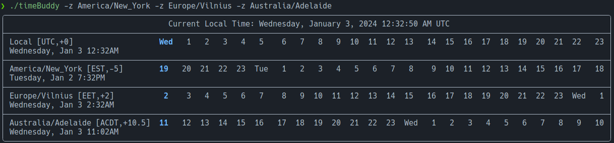

# timeBuddy

CLI based version of [World Time Buddy](https://www.worldtimebuddy.com/)

## Description

TimeBuddy is a CLI tool, implemented in Go, that mimics the functionality of World Time Buddy. It accepts a list of timezones and displays the current time for each in a tabular format. You can use `timeBuddy list` to view a list of all available timezones. Alternatively, you can setup the shell autocompletion script(`timeBuddy completion --help`) for your preferred shell and use tab completion to select the timezones you are interested in.

The program is aware of daylight savings time and adjusts the time for each timezone accordingly. A specific date can also be provided to view the time in each timezone for that date.

The last used timezones, color, and time format preferences are saved in a YAML formatted configuration file. This feature ensures that you need to
specify your preferred time zones only once. The order in which you specify the time zones is retained and reflected in the table output.

- Windows: `$HOME/AppData/Roaming/.timeBuddy.yaml`
- Linux/macOS: `~/.config/.timeBuddy.yaml`

If the configuration file does not exist, it will be created. The configuration file has the following format:

```yaml
color: true
timezone:
    - Local
    - America/New_York
    - Europe/Vilnius
    - Australia/Adelaide
twelve-hour: false
```

## Screenshots





## Installation

1. Download the binary for your preferred platform from the [releases](https://github.com/JakeTRogers/timeBuddy/releases) page
2. Extract the archive. It contains this readme, a copy of the Apache 2.0 license, and the timeBuddy binary.
3. Copy the binary to a directory in your `$PATH`. i.e. `/usr/local/bin`

## Usage

```text
Usage:
  timeBuddy [flags]
  timeBuddy [command]

Available Commands:
  completion  Generate the autocompletion script for the specified shell
  help        Help about any command
  list        List time zones

Flags:
  -c, --color           enable colorized table output. If previously enabled, use --color=false to disable it,
  -d, --date            date to use for time conversion. Expects YYYY-MM-DD format. Defaults to current date/time. (default "2024-01-02")
  -x, --exclude-local   disable default behavior of including local timezone in output
  -h, --help            help for timeBuddy
  -z, --timezone        timezone to use for time conversion. Accepts timezone name, like America/New_York. Can be used multiple times.
  -t, --twelve-hour     use 12-hour time format instead of 24-hour. If previously enabled, use --twelve-hour=false to disable it.
  -v, --verbose         increase logging verbosity, 1=warn, 2=info, 3=debug, 4=trace
      --version         version for timeBuddy

Use "timeBuddy [command] --help" for more information about a command.
```

## Examples

```bash
# Display the current time in New York, Vilnius, and Sydney
timeBuddy -z America/New_York -z Europe/Vilnius -z Australia/Sydney

# Display the current time in 12-hour format and in color using the last used timezones
timeBuddy -t -c

# Display the time table of your last used timezones, color, and time format for a specific date
timeBuddy -d 2024-06-06
```
